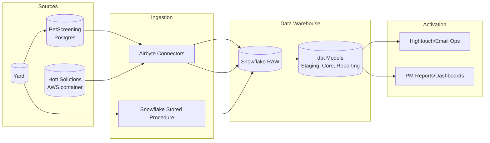
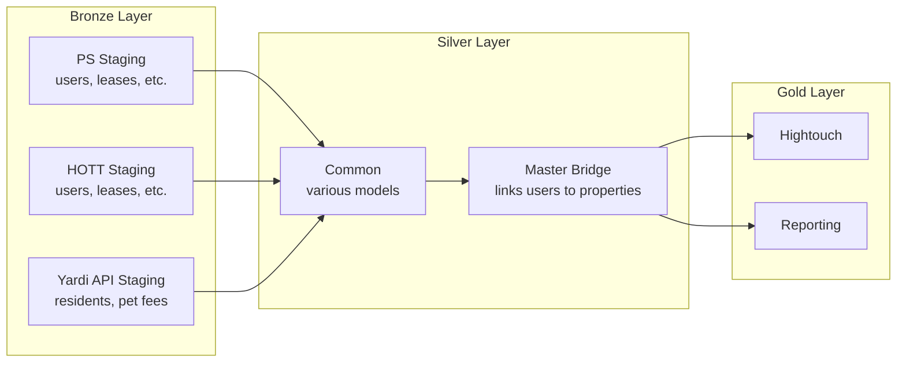
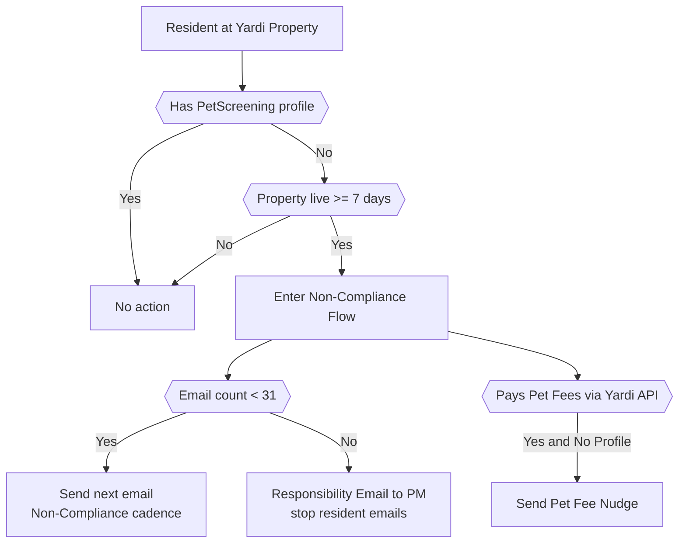
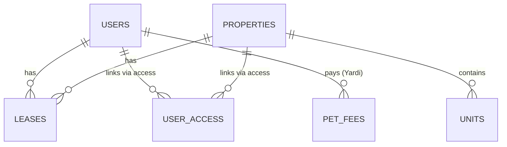
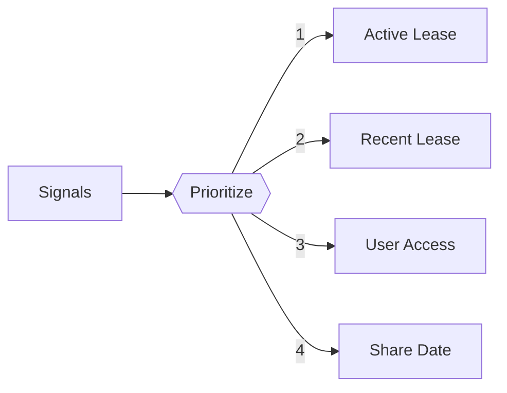

# Yardi Integration — Architecture & Activation Overview
**Date:** September 29, 2025  
**Owner:** Eduardo Salvador & Nick Fernandez
**Audience:** Engineering, Data, Growth/Solutions, Leadership

---

## 0) TL;DR (one‑pager)
- **Goal:** Centralize Yardi data (plus Postgres + Hott Solutions + Yardi APIs) in Snowflake, model it with dbt, and **activate** it (emails/ops/reporting) while keeping property managers informed.
- **Source systems:** Postgres (core app), **Hott Solutions** (CDC w/ deletes), **Yardi API** (resident + pet fee endpoints).
- **Pipelines:** Airbyte → Snowflake (raw) → dbt (staging → core/marts).
- **Key model:** **`pet_screening_master_bridge`** = canonical way to **tie a user to a property** (via leases, share dates, user_access, etc.).
- **Rules:** When Postgres lacks **move_out_date**, prefer **Hott Solutions’** move_out_date (if available) and **propagate** downstream.
- **Activation (Yardi):** _No welcome email_. We **do** run **Non‑Compliance** after **7 days** from property go‑live; **31‑email cap** then **Responsibility hand‑off** to PMs. Also: **Household Draft** campaign (Mon/Wed/Fri) and **Pet Fee nudges** (resident pays pet fees but lacks a profile).
- **PM comms:** Compliance Check‑in + PDF (with **mailto** and **user_does_no_longer_live_here_link** actions), Responsibility email, Value/Revenue email, Pet Fee report.
- **Known gaps:** Pet fee SP needs performance tuning; finalize Yardi endpoint names; instead of archive unshare the profile; ensure CDC deletes are honored end-to-end within Postgres.

---

## 1) Context & Purpose
We need a clear, **technical yet exec‑readable** view of how Yardi integrates with PetScreening data and how that data powers our activation & reporting. This doc is the **source‑of‑truth** for diagrams, rules, and where we’re taking screenshots for the Presentation deck/Miro.

**Deliverables from this doc:**
1) Diagrams (L0–L3), 2) a shot list for screenshots, 3) the exact narrative for leadership, 4) open decisions & risks.

---

## 2) Level-0 Architecture (bird's-eye)


**Narrative:** Old process: Yardi data enters Petscreening application via existing integration, data then leveraged in data warehouse layer. New additions: Hott data enters Snowflake **RAW** via **Airbyte**; Yardi data enters via a **Snowflake stored procedure** calling various API endpoints (residents + pet fees). dbt creates **1:1 staging** (bronze layer models) and then incorporates into **core/marts** (silver and gold layer models) for activation/reporting.

---

## 3) Data Sources (what & why)
### 3.1 Postgres (PetScreening App DB)
- **Tables used (primary):** `users`, `leases`, `units`, `pet_profiles`, `property_managers`, `user_access`.
- **Strengths:** Near‑real‑time app truth for user/properties; rich user keys.
- **Gaps:** Occasional **missing move_out_date** from yardi integration; no CDC.

### 3.2 Hott Solutions (CDC with deletes)
- **Feeds:** Similar entities as our core(common) Snowflake layer — users, leases, units, properties, lease_user_access, parent_companies.
- **Value:** **Reliable move_out_date**, explicit **deletes** via CDC streams.
- **Rule:** Incorporate into early silver layer `f_leases` table; if Postgres **move_out_date is NULL**, **use Hott’s** value.

### 3.3 Yardi API (Resident endpoints)
- **Purpose:** Determine current residents in Yardi, utilize to augment/correct PS resident data in Snowflake.
- **Mechanism:** **Snowflake Stored Procedure** (Nick) fetches and writes into Snowflake weekly (single table with primary residents + secondary occupants).
- **Optimization need:** Improve SP runtime; Yardi SOAP API takes a long time to request.

### 3.4 Yardi API (Pet Fee endpoints)
- **Purpose:** Know **who is being charged pet fees** in Yardi, compare against PetScreening profiles for targets.
- **Mechanism:** **Snowflake Stored Procedure** (Thiago) fetches and writes into Snowflake (two fee tables).
- **Optimization need:** Improve SP runtime & idempotency (batching, pagination, slim columns).

---

## 4) Ingestion Layer
### 4.1 Airbyte
- **Connectors:** Postgres → Snowflake, Hott → S3 → Snowflake (CDC).  
- **Landing:** `RAW` schema (or `AIRBYTE` schema), partitioned by `_airbyte_extracted_at`.  
- **Scheduling:** Daily + ad‑hoc backfills (add your exact cron for deck).  
- **Quality hooks:** Row counts, _last seen_ timestamps, CDC checksum checks (if enabled).

### 4.2 Snowflake Stored Procedure (Residents API, Pet Fees API)
- **Inputs:** Property/account scoping parameters, auth/keys (stored in secrets/parameters).  
- **Outputs:** `raw.pmc_external_integrations.st__yardi_*`.  
- **Schedule:** via **Task** or **dbt** (TBD here but aiming for once a month for pet fees).  
- **Perf:** Aim for **incremental pulls** (since last run); handle **rate limits**.

---

## 5) Warehouse Model Strategy (dbt)
**Strategy:** Medallion approach (bronze-silver-gold) for data modelling. Raw data is first formatted in bronze layer (staging models). Silver layer for more meaningful transformations, calculations, and joins. Gold layer (reporting/hightouch models) for business-ready data.  
**Schemas:** `staging` (bronze layer); `common`, `petscreening` (silver layer); `hightouch`, `reporting` (gold layer).  
**Naming:** `stg_source__table` (staging tables named by source), `f__* or d_*` (common "facts" and "dimensions" tables), `ht_*, or r__*` (hightouch and reporting tables).


**Narrative:** Basic data model structure in DBT. All sources have an initial bronze layer staging model. The silver layer contains most logic. Various silver layer models culminate in the master bridge model, linking users and properties via various sources. Finally, the master bridge is referenced in the gold layer models.

### 5.1 Staging (1:1 replicas)
- **Targets:** `_airbyte_data` JSON → typed columns.  
- **Keep coalesces** for field case variants (e.g., `LEASE_ID` vs `lease_id`).  
- **Tests:** uniqueness, not‑nulls, referential integrity (FKs), freshness.

### 5.2 Core models (join logic)
- **`core__leases`** = merged truth from Postgres & Hott.  
  - Rule: `move_out_date := COALESCE(hott.move_out_date, postgres.move_out_date)`
- **`core__users`, `core__properties`, `core__units`, `core__user_access`** standardized with keys.  
- **`core__pet_fees`** from Yardi SP tables, normalized.

### 5.3 Master Bridge (canonical user↔property)
> **Model:** `petscreening__user_properties_master_bridge`  
**Purpose:** Deduplicate and unify **all ways** a user can link to a property.

**Link paths (prioritized):**
1. **Active lease** (within window)  
2. **Recent lease** (w/ move_out_date within grace)  
3. **User access / property_user_link_source**  
4. **Share date** fallback when no lease is present (e.g., `share_date >= go_live - 1d`)

**Key fields to compute:**
- `lease_email_flow_trigger_date`  
- `lease_include_in_email_flow` (boolean)  
- `property_live_date`  
- `is_archived_flag`  
- `user_data_source`, `lease_data_source`

**Pseudocode snippet (simplified):**
```sql
with leases as (
  select user_key, property_id,
         coalesce(hott.move_out_date, pg.move_out_date) as move_out_date,
         start_date, end_date
  from core__leases
),
links as (
  select user_key, property_id, property_user_link_source, share_date
  from core__user_property_links -- from user_access / shares
),
bridge as (
  select
    u.user_key,
    p.property_id,
    /* priority: active lease > recent lease > link > share */
    coalesce(l_active.property_id, l_recent.property_id, links.property_id) as resolved_property_id,
    greatest_ignore_nulls(start_date, lease_start_date) as lease_start_date,
    greatest_ignore_nulls(end_date, lease_end_date) as lease_end_date,
    coalesce(hott_move_out_date, pg_move_out_date) as move_out_date,
    property_user_link_source,
    share_date,
    compute_email_flow_trigger_date(...) as lease_email_flow_trigger_date,
    compute_include_in_flow(...) as lease_include_in_email_flow
  from core__users u
  left join leases l_active on ...
  left join leases l_recent on ...
  left join links on ...
)
select * from bridge;
```

**Tests:** 1 row per `{user_key, resolved_property_id}`; recentness rules; null guards.

---

## 6) Activation (what we actually send & when)
### 6.1 Campaign summary (Yardi specifically)
- **Welcome campaign:** **NOT sent** for Yardi (only for Entrata, ResMan, custom integrations).  
- **Non‑Compliance campaign:** **Yes**. Target = residents **without** a PetScreening profile, **7 days** after property **go‑live**.  
  - **Cadence/Cap:** Up to **31 emails** max; then stop.  
  - **Hand‑off:** Trigger **Responsibility email** to PMs after 31.  
- **Household Draft campaign (Growth):** Mon / Wed / Fri. (Define exact audience & examples.)  
- **Pet Fee nudges:** If **paying pet fees** in Yardi but **no profile**, email the resident.

### 6.2 Decision Flow (Mermaid)


### 6.3 Hightouch / Send engine
- **Syncs:** one per campaign; filtered by `lease_include_in_email_flow`, `email_count`, `pays_pet_fees`, etc.  
- **Schedules:** e.g., Non‑Compliance daily ~8:45 AM ET; Household Draft M/W/F.  
- **Safety:** global unsubscribes, 31‑cap, suppressions (moved out).

---

## 7) Property Manager Communications
- **Compliance Check‑in (email + PDF):** Lists **recent move‑ins** missing profiles; includes **mailto** links and **user_does_no_longer_live_here_link** button per resident.  
- **Responsibility Email (after 31):** “We’ve reached out 31 times; hand‑off to you.” Includes **email resident** + **user_does_no_longer_live_here_link** actions.  
- **Value/Revenue Email Prototype:** Shows **revenue/value** generated.  
- **Pet Fee Report:** PM view of **who is/ isn’t paying fees** and whether they have a profile.

**Action links to confirm:**
- `mailto` prefilled template  
- `archive_user_link` (recently added; need to change to user_does_no_longer_live_here_link)  
- property/user deep links (internal admin UI)

---

## 8) Reporting & KPIs 
- **Coverage:** % of Yardi residents with valid property assignment; **bridge completeness**.  
- **Zendesk:** Less yardi complaints.  
- **Campaign:** Open/click rates, completion test vs. holdout, **31‑cap %**.  
- **Pet Fees:** # residents paying fees without profile; close rate after nudge.  
- **Data Freshness:** Last extract times (Postgres, Hott, Yardi API).  
- **Data Quality:** DQ failures (nulls on keys, FK breaks, duplicate leases).

---

## 9) Operations & Runbook
- **Schedules:** Airbyte pull windows; SP task cadence (once a month?); Hightouch syncs.  
- **Backfills:** How to backfill a property/date range safely.  
- **On‑call:** Where alerts land; common failure causes; first checks (row counts, task status).  
- **CDC Deletes:** How we materialize deletes downstream (soft‑delete flags vs hard delete).  
- **Archival rules:** When we mark `is_archived_flag = true` .

---

## 10) Known Issues & Decisions
1) **Move‑out coalesce**: Using Hott’s `move_out_date` when Postgres is null → **standardized everywhere**.  
2) **Pet Fee SP performance**: Batch, incremental since last successful run, add indexes, only necessary columns.  
4) **CDC deletes**: Verify downstream **exclusions** (e.g., if a lease is deleted, ensure resident is suppressed).  
5) **Welcome emails**: Remain disabled for Yardi unless we want to enable it and removde from platform (literally one line of sql); evaluate comms implications.
6) Need to change archive to user_does_no_longer_live_here_link in responsability email.
7) **Feedback**: Waiting to recieve complaints so we can triage it or if we missed anything.

---

## 11) Open Questions (fill during review)
- Exact **Yardi API endpoint names** + field mapping (meeting with Thiago tomorrow for this).  
- Should we go and recreate this with other integrations.
- Should we write into Postgres with the accurate lease data that we are missing.
- Should we change or include any additional output.  

---

## 12) Agenda / Diagram For Presentation (draft)
1) TLDR What we have done and why it matters (Improve resident data, net new value proposition have pet fees data?)
2) Older existing yardi where we started (architecture mermaid diagram) – Eduardo
3) Find email complaint of user not living there for yardi – eduardo
4) Issues which we found was status changes
5) Limitations hott solutions coming in with cdc
6) New Yardi (architecture diagram) – Eduardo
7) Data Models and where new data plugs in – Nick
8) Nuances from master bridge into email issues? – both
9) What is it used for - outputs – Eduardo
10) Lessons Learned/Next Steps – Nick (Pet fees we are currently only pinging the integrations where state=enabled which there a mismatch in postgres and snowflake ~100)


---

## 13) Level‑1/2 Diagrams (data detail draft might need to change currently joining pet fees to units but exploring direct linkage to users tbd here)
### 13.1 Entity map


### 13.2 Master Bridge precedence


---

## 14) Appendix A — Key Fields (reference)
- `property_go_live_date`: when integration went live for property.  
- `lease_email_flow_trigger_date`: derived date to start Non‑Compliance.  
- `lease_include_in_email_flow`: boolean gate for activation.  
- `email_count`, `email_count_31_reached_at`: campaign counters.  
- `move_out_date`: **coalesced** value (Hott > PG).  
- `is_archived_flag`: excludes user from further emails.

---

## 15) Appendix B — Example Filters (SQL fragments)
```sql
-- Eligible for Non-Compliance (Yardi):
where  compliance_status = 'non_compliant'
  and property_live_date <= current_date - 7
  and coalesce(is_archived_flag,false) = false
  and (email_count < 31 or email_reached_31_date is not null)
```

```sql
-- Pet Fee Nudge target:
where
   has_profile = false
  and pays_pet_fees = true
```

---

## 16) Appendix C — Governance & Owners
- **Owners:** Nick, Eduardo.  
- **dbt models:** Data team (Eduardo, Nick, Will, Christian).  
- **Airbyte:** Data Eng (Eduardo, Will, Nick).  
- **Pet Fee SP:** Thiago, Nick, Will — performance + keys.  
- **Email Ops:** Andy, Eduardo, Christian.
- **Reporting:** Beau, Nick, Andrew, Jacob.

---

## 17) Miro Board Output (in progress)
1) https://miro.com/app/board/uXjVJBDE5zg=/

---

## 18) Next Steps
- Create presentation.
- Grab the screenshots on the shot list and drop into the deck/Miro.  
- Schedule SP improvements and document cron for all jobs.

---

## 19) Yardi Lessons Learned
Research into API endpoints and physical site visits by the data team led to several discoveries, forwarded to the product team here: https://petscreening.atlassian.net/wiki/x/BYDvH
- Move-out dates: the existing PS integration misses many move out dates, because the resident status often immediately changes to "notice" or "past" when a move-out date is added, whereas the integration only gets data for residents in the "current" and "future" statuses. This causes us to believe some residents are still current, when in reality they moved out.
- Tenant relationships: learned many occupants that appear to be roommates in PS are actually of a relationship that doesn't live there in reality - guarantors, minors, etc.
- Overall picture of current residents: learned that the yardi GetResidents endpoint does accurately deliver the property's picture of current residents. The primary cause of misalignement with PS is missing move out dates; there are some other reasons, listed in the confluence page, such as a resident missing an email (therefore PS user creation fails).

---

## 20) Next PMC Integrations Roadmap

After completing the Yardi integration, the following Property Management Companies (PMCs) are prioritized for integration. Each PMC offers different API endpoints that require their own code to accomodate.

### 20.1 PMC Integration Status

| PMC | API Endpoints | Status |
|-----|---------------|--------|
| **Entrata** | GetLeases | ☐ |
| | GetPropertyFees | ☐ | |
| **AppFolio** | GetTenants | ☑ |
| | charges | ☑ | |
| **RealPage** | GetTenants | 🔄 |
| | GetScheduledCharges | 🔄 | |
| | petfees | 🔄 | |
| **Buildium** | TBD | ☐ |

**Legend:**
- ☑ Completed
- ☐ Not Started
- 🔄 In Progress

### 20.2 Success Criteria

For each PMC integration:
- [ ] **Data Completeness**: 95%+ resident data coverage
- [ ] **Real-time Sync**: < 24 hour data latency
- [ ] **Activation Ready**: Email campaigns functional
- [ ] **PM Dashboard**: Property manager reporting accurate

### 20.3 Technical Requirements

Each PMC integration will follow the same architectural pattern as Yardi:
1. **API Integration**: Snowflake Stored Procedures for data extraction
2. **Modeling**: Bronze → Silver → Gold data modeling approach
3. **Activation**: Data leveraged for email campaigns and PM reporting
