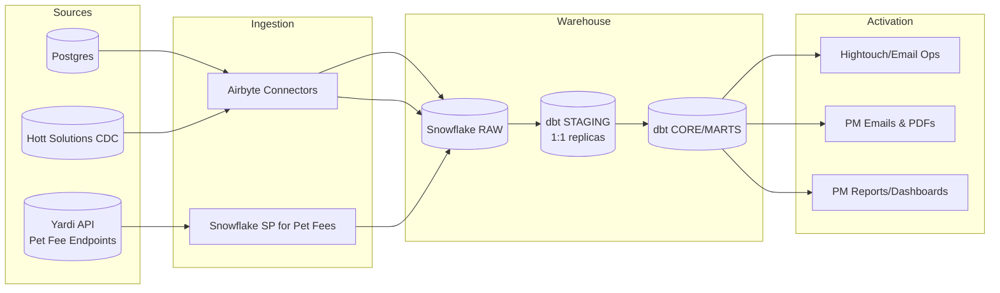

# Yardi Integration — Architecture & Activation Overview
**Date:** September 29, 2025  
**Owner:** Eduardo Salvador & Nick Fernandez
**Audience:** Engineering, Data, Growth/Compliance, Leadership

---

## 0) TL;DR (one‑pager)
- **Goal:** Centralize Yardi data (plus Postgres + Hott Solutions + Yardi APIs) in Snowflake, model it with dbt, and **activate** it (emails/ops/reporting) while keeping property managers informed.
- **Source systems:** Postgres (core app), **Hott Solutions** (CDC w/ deletes), **Yardi API** (resident + pet fee endpoints).
- **Pipelines:** Airbyte → Snowflake (raw) → dbt (staging → core/marts).
- **Key model:** **`pet_screening_master_bridge`** = canonical way to **tie a user to a property** (via leases, share dates, user_access, etc.).
- **Rules:** When Postgres lacks **move_out_date**, prefer **Hott Solutions’** move_out_date (if available) and **propagate** downstream.
- **Activation (Yardi):** _No welcome email_. We **do** run **Non‑Compliance** after **7 days** from property go‑live; **31‑email cap** then **Responsibility hand‑off** to PMs. Also: **Household Draft** campaign (Mon/Wed/Fri) and **Pet Fee nudges** (resident pays pet fees but lacks a profile).
- **PM comms:** Compliance Check‑in + PDF (with **mailto** and **archive_user_link** actions), Responsibility email, Value/Revenue email, Pet Fee report.
- **Known gaps:** Pet fee SP needs performance tuning; finalize Yardi endpoint names; lease-reset logic for 31-email counter; ensure CDC deletes are honored end-to-end.

---

## 1) Context & Purpose
We need a clear, **technical yet exec‑readable** view of how Yardi integrates with PetScreening data and how that data powers our activation & reporting. This doc is the **source‑of‑truth** for diagrams, rules, and where we’re taking screenshots for the deck/Miro.

**Deliverables from this doc:**
1) Diagrams (L0–L3), 2) a shot list for screenshots, 3) the exact narrative for leadership, 4) open decisions & risks.

---

## 2) Level-0 Architecture (bird's-eye)
Paste this Mermaid into Mermaid Live (or Miro w/ plug-in) to render.


**Narrative:** Postgres + Hott enter via **Airbyte** to Snowflake **RAW**. Yardi **pet fee** data enters via a **Snowflake stored procedure** (SP). dbt creates **1:1 staging** and then **core/marts** for activation/reporting.

---

## 3) Data Sources (what & why)
### 3.1 Postgres (App DB)
- **Tables used (primary):** `users`, `leases`, `units`, `properties`, `property_managers`, `user_access` (names may vary; use actual schema names in screenshots).
- **Strengths:** Near‑real‑time app truth for user/properties; rich user keys.
- **Gaps:** Occasional **missing move_out_date** or delayed updates.

### 3.2 Hott Solutions (CDC with deletes)
- **Feeds:** Similar entities as our core(common) Snowflake layer — users, leases, units, properties, lease_user_access, parent_companies.
- **Value:** **Reliable move_out_date**, explicit **deletes** via CDC streams.
- **Rule:** If Postgres **move_out_date is NULL**, **use Hott’s** value.

### 3.3 Yardi API (Resident endpoints)
- **Purpose:** Determine current residents in Yardi, utilize to augment PS resident data.
- **Mechanism:** **Snowflake Stored Procedure** (Nick) fetches and writes into Snowflake weekly (single table with primary residents + secondary occupants).
- **Optimization need:** Improve SP runtime; Yardi SOAP API takes a long time to request.

### 3.4 Yardi API (Pet Fee endpoints)
- **Purpose:** Know **who is being charged pet fees** in Yardi, compare against PetScreening profiles for targets.
- **Mechanism:** **Snowflake Stored Procedure** (Thiago) fetches and writes into Snowflake (two fee tables).
- **Optimization need:** Improve SP runtime & idempotency (batching, pagination, slim columns).

---

## 4) Ingestion Layer
### 4.1 Airbyte
- **Connectors:** Postgres → Snowflake, Hott → Snowflake (CDC).  
- **Landing:** `RAW` schema (or `AIRBYTE` schema), partitioned by `_airbyte_extracted_at`.  
- **Scheduling:** Daily + ad‑hoc backfills (add your exact cron for deck).  
- **Quality hooks:** Row counts, _last seen_ timestamps, CDC checksum checks (if enabled).

### 4.2 Snowflake Stored Procedure (Residents API, Pet Fees API)
- **Inputs:** Property/account scoping parameters, auth/keys (stored in secrets/parameters).  
- **Outputs:** `raw.pmc_external_integrations.yardi_*` (e.g., `pet_fee_headers`, `pet_fee_lines`).  
- **Schedule:** via **Task** or external orchestrator (document actual cadence).  
- **Perf:** Aim for **incremental pulls** (since last run); handle **rate limits**.

---

## 5) Warehouse Model Strategy (dbt)
**Schemas:** `staging` (1:1), `common` (business logic), `hightouch/reporting` (activation/reporting).  
**Naming:** `stg_source__table`, `f__* or d_*`, `ht_*, or r__*` (align to our conventions).

### 5.1 Staging (1:1 replicas)
- **Targets:** `_airbyte_data` JSON → typed columns.  
- **Keep coalesces** for field case variants (e.g., `LEASE_ID` vs `lease_id`).  
- **Tests:** uniqueness, not‑nulls, referential integrity (FKs), freshness.

### 5.2 Core models (join logic)
- **`core__leases`** = merged truth from Postgres & Hott.  
  - Rule: `move_out_date := COALESCE(hott.move_out_date, postgres.move_out_date)`
- **`core__users`, `core__properties`, `core__units`, `core__user_access`** standardized with keys.  
- **`core__pet_fees`** from Yardi SP tables, normalized.

### 5.3 Master Bridge (canonical user↔property)
> **Model:** `petscreening__user_properties_master_bridge`  
**Purpose:** Deduplicate and unify **all ways** a user can link to a property.

**Link paths (prioritized):**
1. **Active lease** (within window)  
2. **Recent lease** (w/ move_out_date within grace)  
3. **User access / property_user_link_source**  
4. **Share date** fallback when no lease is present (e.g., `share_date >= go_live - 1d`)

**Key fields to compute:**
- `lease_email_flow_trigger_date`  
- `lease_include_in_email_flow` (boolean)  
- `property_live_date`  
- `is_archived_flag`  
- `user_data_source`, `lease_data_source`

**Pseudocode snippet (simplified):**
```sql
with leases as (
  select user_key, property_id,
         coalesce(hott.move_out_date, pg.move_out_date) as move_out_date,
         start_date, end_date
  from core__leases
),
links as (
  select user_key, property_id, property_user_link_source, share_date
  from core__user_property_links -- from user_access / shares
),
bridge as (
  select
    u.user_key,
    p.property_id,
    /* priority: active lease > recent lease > link > share */
    coalesce(l_active.property_id, l_recent.property_id, links.property_id) as resolved_property_id,
    greatest_ignore_nulls(start_date, lease_start_date) as lease_start_date,
    greatest_ignore_nulls(end_date, lease_end_date) as lease_end_date,
    coalesce(hott_move_out_date, pg_move_out_date) as move_out_date,
    property_user_link_source,
    share_date,
    compute_email_flow_trigger_date(...) as lease_email_flow_trigger_date,
    compute_include_in_flow(...) as lease_include_in_email_flow
  from core__users u
  left join leases l_active on ...
  left join leases l_recent on ...
  left join links on ...
)
select * from bridge;
```

**Tests:** 1 row per `{user_key, resolved_property_id}`; recentness rules; null guards.

---

## 6) Activation (what we actually send & when)
### 6.1 Campaign summary (Yardi specifically)
- **Welcome campaign:** **NOT sent** for Yardi (only for Entrata, ResMan, custom integrations).  
- **Non‑Compliance campaign:** **Yes**. Target = residents **without** a PetScreening profile, **7 days** after property **go‑live**.  
  - **Cadence/Cap:** Up to **31 emails** max; then stop.  
  - **Hand‑off:** Trigger **Responsibility email** to PMs after 31.  
- **Household Draft campaign (Growth):** Mon / Wed / Fri. (Define exact audience & examples.)  
- **Pet Fee nudges:** If **paying pet fees** in Yardi but **no profile**, email the resident.

### 6.2 Decision Flow (Mermaid)
```mermaid
flowchart TD
  A[Resident at Yardi Property] --> B{{Has PetScreening profile?}}
  B -- Yes --> X[No action]
  B -- No --> C{{Property live >= 7 days?}}
  C -- No --> X
  C -- Yes --> D[Enter Non-Compliance Flow]
  D --> E{{Email count < 31?}}
  E -- Yes --> F["Send next email<br/>(Non-Compliance cadence)"]
  E -- No --> G["Responsibility Email to PM<br/>(stop resident emails)"]
  D --> H{{Pays Pet Fees? (Yardi API)}}
  H -- Yes & No Profile --> I[Send Pet Fee Nudge]
```

### 6.3 Hightouch / Send engine
- **Syncs:** one per campaign; filtered by `lease_include_in_email_flow`, `email_count`, `pays_pet_fees`, etc.  
- **Schedules:** e.g., Non‑Compliance daily ~8:45 AM ET; Household Draft M/W/F; document exact cron.  
- **Safety:** global unsubscribes, 31‑cap, suppressions (archived, moved out).

---

## 7) Property Manager Communications
- **Compliance Check‑in (email + PDF):** Lists **recent move‑ins** missing profiles; includes **mailto** links and **archive_user_link** button per resident.  
- **Responsibility Email (after 31):** “We’ve reached out 31 times; hand‑off to you.” Includes **email resident** + **archive** actions.  
- **Value/Revenue Email:** Shows **revenue/value** generated.  
- **Pet Fee Report:** PM view of **who is/ isn’t paying fees** and whether they have a profile.

**Action links to confirm:**
- `mailto` prefilled template  
- `archive_user_link` (recently added; include example link format)  
- property/user deep links (internal admin UI)

---

## 8) Reporting & KPIs 
- **Coverage:** % of Yardi residents with valid property assignment; **bridge completeness**.  
- **Compliance:** Profile completion rate; time‑to‑complete.  
- **Campaign:** Open/click rates, completion lift vs. control, **31‑cap %**.  
- **Pet Fees:** # residents paying fees without profile; close rate after nudge.  
- **Data Freshness:** Last extract times (Postgres, Hott, Yardi API).  
- **Data Quality:** DQ failures (nulls on keys, FK breaks, duplicate leases).

---

## 9) Operations & Runbook
- **Schedules:** Airbyte pull windows; SP task cadence (once a month?); Hightouch syncs.  
- **Backfills:** How to backfill a property/date range safely.  
- **On‑call:** Where alerts land; common failure causes; first checks (row counts, task status).  
- **CDC Deletes:** How we materialize deletes downstream (soft‑delete flags vs hard delete).  
- **Archival rules:** When we mark `is_archived_flag = true` (e.g., PM clicked archive).

---

## 10) Known Issues & Decisions
1) **Move‑out coalesce**: Using Hott’s `move_out_date` when Postgres is null → **standardized everywhere**.  
2) **Pet Fee SP performance**: Batch, incremental since last successful run, add indexes, only necessary columns.  
4) **CDC deletes**: Verify downstream **exclusions** (e.g., if a lease is deleted, ensure resident is suppressed).  
5) **Welcome emails**: Remain disabled for Yardi unless PM requests opt‑in; evaluate legal/comms implications.  
6) **Share date fallback**: Ensure we don’t over‑include users without leases; require minimum signals (share_date proximity to go‑live).

---

## 11) Open Questions (fill during review)
- Exact **Yardi API endpoint names** + field mapping (ask Thiago).  
- Final **cron** times per job/sync.  

---

## 12) Screenshot / Diagram Shot List (for deck/Miro)
1) **Airbyte**: Postgres → Snowflake connector settings; Hott CDC stream showing deletes.  
2) **Snowflake RAW**: Sample raw table (with `_airbyte_extracted_at`).  
3) **dbt DAG**: Staging nodes → core → `pet_screening_master_bridge`.  
4) **Model code**: Snippet showing `move_out_date` coalesce rule.  
5) **Activation filters**: Hightouch or SQL driving Non‑Compliance & 31‑cap.  
6) **Pet Fee SP**: excerpt of SP call logs / target tables.  
7) **PM Emails**: Compliance Check‑in, Responsibility email, Value email, Pet Fee report.  
8) **Action links**: `mailto` + `archive_user_link` example.

---

## 13) Level‑1/2 Diagrams (data detail)
### 13.1 Entity map


### 13.2 Master Bridge precedence


---

## 14) Appendix A — Key Fields (reference)
- `property_live_date`: when integration went live for property.  
- `lease_email_flow_trigger_date`: derived date to start Non‑Compliance.  
- `lease_include_in_email_flow`: boolean gate for activation.  
- `email_count`, `email_count_31_reached_at`: campaign counters.  
- `move_out_date`: **coalesced** value (Hott > PG).  
- `is_archived_flag`: excludes user from further emails; surfaced to PM.

---

## 15) Appendix B — Example Filters (SQL fragments)
```sql
-- Eligible for Non-Compliance (Yardi):
where provider = 'yardi'
  and has_profile = false
  and property_live_date <= current_date - 7
  and coalesce(is_archived_flag,false) = false
  and (email_count is null or email_count < 31)
```

```sql
-- Pet Fee Nudge target:
where provider = 'yardi'
  and has_profile = false
  and pays_pet_fees = true
```

---

## 16) Appendix C — Governance & Owners
- **Owners:** Nick, Eduardo.  
- **dbt models:** Data team (Will, Nick, Eduardo, Christian).  
- **Airbyte:** Data Eng (Eduardo, Will, Nick).  
- **Pet Fee SP:** Thiago, Nick, Will — performance + keys.  
- **Email Ops:** Andy, Eduardo, Christian.

---

## 17) Miro Board Layout (frames)
1) **L0 Diagram** (Sources→Ingestion→Warehouse→Activation).  
2) **Source Cards** (PG, Hott, Yardi API) with pros/cons.  
3) **dbt Flow** (staging→core→bridge).  
4) **Activation Flows** (Non‑Compliance, Pet Fees, Household Draft).  
5) **PM Comms** (screenshots + action link notes).  
6) **KPIs** & **Runbook**.  
7) **Risks/Decisions/Questions** (interactive sticky area).

---

## 18) Next Steps
- Fill endpoint names + add a short mapping table for Pet Fee fields.  
- Grab the screenshots on the shot list and drop into the deck/Miro.  
- Decide lease‑reset rule for 31‑cap; implement & test.  
- Schedule SP improvements and document cron for all jobs.
